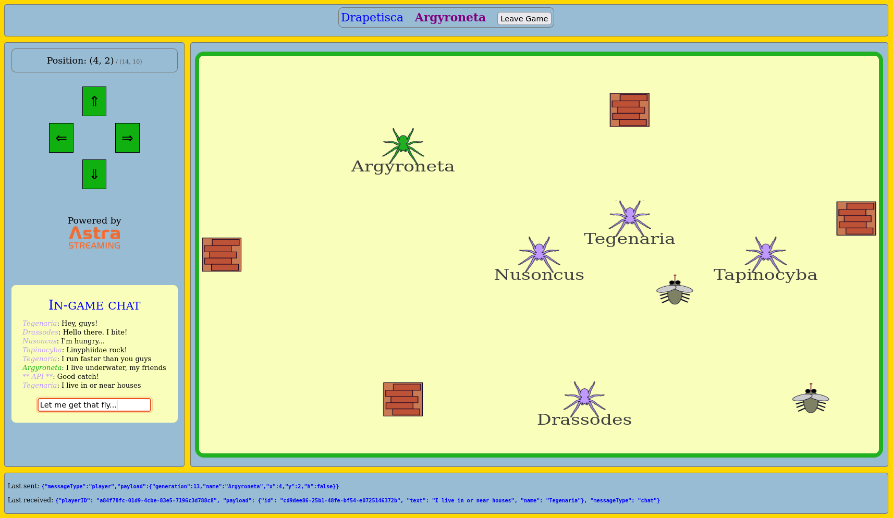

<!--- STARTEXCLUDE --->
# Drapetisca: a multiplayer online game with Astra Streaming and Websockets

[](https://gitpod.io/#https://github.com/datastaxdevs/workshop-streaming-game)
[](http://www.apache.org/licenses/LICENSE-2.0)
[](https://discord.com/widget?id=685554030159593522&theme=dark)

Time: *50 minutes*. Difficulty: *Intermediate*. [Start Building!](#lets-start)

A simple multiplayer online game featuring
* Astra Streaming (a messaging system in the cloud, built on top of Apache Pulsar)
* Astra DB (a Database-as-a-service built on Apache Cassandra)
* WebSockets
* React.js for the front-end
* the Python FastAPI framework for the back-end

<!--- ENDEXCLUDE --->



## Objectives
* Understand the architecture of a streaming-based application
* Learn how Apache Pulsar works
* See the interplay between streaming and persistent storage (a.k.a. database)
* Learn about Websockets on client- and server-side
* Understand how a FastAPI server can bridge Pulsar topics and WebSockets
* Understand the structure of a Websocket React.js application
* **get your very own online gaming platform to share with your friends!**

## Frequently asked questions

- *Can I run the workshop on my computer?*

> You don't have to, it's all already in the cloud! But there is nothing preventing you from running the workshop on your own machine.
> If you do so, you will need
> * git installed on your local system
> * [node 15 and npm 7 or later](https://www.whitesourcesoftware.com/free-developer-tools/blog/update-node-js/)
> * [Python v3.8+ installed on your local system](https://www.python.org/downloads/)
>
> In this readme, we try to provide instructions for local development as well - but keep in mind that
> the main focus is development on Gitpod, hence **We can't guarantee live support** about local development
> in order to keep on track with the schedule. However, we will do our best to give you the info you need to succeed.

- *What other prerequisites are there?*
> * You will need a GitHub account
> * You will also need an Astra account: don't worry, we'll work through that in the following

- *Do I need to pay for anything for this workshop?*
> * **No.** All tools and services we provide here are FREE.

- *Will I get a certificate if I attend this workshop?*

> Attending the session is not enough. You need to complete the homeworks detailed below and you will get a nice participation certificate a.k.a. badge.

- *Why "Drapetisca"?*

> _Drapetisca socialis_, known as "invisible spider", is a very small and hard-to-notice spider found throughout Europe.
> Since this is a multiplayer game that lets players have social interactions in the play area, why not choose a spider
> with "socialis" in its name?

## Materials for the Session

It doesn't matter if you join our workshop live or you prefer to work at your own pace,
we have you covered. In this repository, you'll find everything you need for this workshop:

- [Workshop Video](https://youtu.be/jfOBPlcd9eA)
- [Slide deck](slides/DataStaxDevs-workshop-Build_a_Multiplayer_Game_with_Streaming.pdf)
- [Discord chat](https://dtsx.io/discord)
- [Questions and Answers](https://community.datastax.com/)

## Homework


Don't forget to complete your assignment and get your verified skill badge! Finish and submit your homework!

1. Complete the practice steps as described below until you have your own app running in Gitpod.
2. Now roll up your sleeves and modify the code in two ways: (1) we want the API to send a greeting to each new player in the chat box, and (2) we want the player names in the game area to match the icon color. _Please read the detailed guidance found [below](#7-homework-instructions)_.
3. Take a SCREENSHOT of the running app modified this way. _Note: you will have to restart the API and reload the client to see all changes!_
4. Submit your homework [here](https://dtsx.io/streaming-game-homework).

That's it, you are done! Expect an email in a few days!

# Let's start

## Table of contents

1. [Create your Astra Streaming instance](#1-create-your-astra-streaming-instance)
2. [Create your Astra DB instance](#2-create-your-astra-db-instance)
3. [Load the project into Gitpod](#3-load-the-project-into-gitpod)
4. [Set up/start the API](#4-api-setup)
5. [Set up/start the client](#5-client-setup)
6. [Play!](#6-play-the-game)
7. [Homework instructions](#7-homework-instructions)
8. [Selected topics](#8-selected-topics)

## Astra setup

### 1. Create your Astra Streaming instance

_**`Astra Streaming`** is the simplest way to get a streaming infrastructure based on Apache Pulsar
with zero operations at all - just push the button and get your streaming.
No credit card required - with the **free tier** comes a generous monthly-renewed credit for you to use._

_**`Astra Streaming`** is tightly integrated with `Astra DB`, the database-as-a-service
used in most of our workshops (see below, we will use it momentarily).
**If you already have an Astra account for Astra DB, you can use that
one in the following (and jump to "Create streaming" below)!**_

For more information on Astra Streaming, look at [the docs](https://docs.datastax.com/en/astra-streaming/docs/).
For more information on Apache Pulsar, here is [the documentation](https://pulsar.apache.org/docs/en/concepts-overview/).

#### 1a. Register

Register and sign in to Astra at `https://astra.datastax.com` by clicking this button (better in a new tab with Ctrl-click or right-click):

<a href="https://astra.dev/2-2"></a>

_you can use your `Github`, `Google` accounts or register with an `email`.
Choose a password with minimum 8 characters, containing upper and lowercase letters, at least one number and special character.
You may be asked to verify your email, so make sure you have access to it._

<details><summary>Show me the steps</summary>
    
</details>

#### 1b. Create streaming

Once registered and logged in, you will be able to create a streaming topic for use in this workshop.

Now it's time to create a new Astra Streaming topic, that will convey all messages for this app.

- Go to your Astra console, locate the "Create Streaming" button on the left window and to the right of Streaming. Click on it.
- Set up a new Tenant (remember Pulsar has a multi-tenant architecture): _you have to find a globally unique name for it_,
so for instance if `gameserver` is already taken by someone, try `gameserver0`, `gameserver-abc` or something similar.
Pick the provider/region you like (_try to have it close to you for reduced latency_) and finally hit "Create Tenant". **Remember the name of your tenant for the API setup step later**.
- You'll shortly see the dashboard for your newly-created Tenant. Go to the "Topics" tab to create a new one (we will stay in the "default" namespace).
- In the "Topics" tab, click "Add Topic" and name it `worldupdates` (persistent = yes, partitioned = no). Click "Save" to confirm topic creation.

Congratulations! Your topic is being created, which takes less than one minute, and is now ready to receive and
dispatch the stream of messages that will make your game work!

> Note: technically you can name your namespace and topic anything you want - but then you have to make sure
> the environment settings for your API code are changed accordingly (see later).

<details><summary>Show me the steps</summary>
    
</details>

#### 1c. Retrieve streaming connection parameters

While you are at it, you should get two pieces of information needed later to connect to the topic
from the API code. While still in the tenant dashboard, find the "Connect" tab and click on it: you will see a listing of "Tenant Details". You will later need the "Broker Service URL" and the "Token" values:

- the "Broker service URL" is given in the "Connect" tab;
- the "Token" is a secret string needed to connect to the topic and is reached by clicking on "Token Manager" and then, once you locate your token in the list, can be directly copied to your clipboard with the "clipboard" icon next to it. _Note: a token is created for you automatically at this point._

<details><summary>Show me the how to get the topic connection parameters</summary>
    
</details>

> The service URL looks something like `pulsar+ssl://pulsar-[...].streaming.datastax.com:6651`,
while the token is a very long string such as `eyJhbGci [...] cpNpX_qN68Q`.
> **The token is a secret string and you should keep it for yourself!**

### 2. Create your Astra DB instance

Besides the streaming platform, you'll also need a database for persistence of some
game data (the server-side representation of the "game world").

Correspondingly, you will need some connection parameters and secrets in order
to later be able to access the database.

#### 2a. Create the database

_**`ASTRA DB`** is the simplest way to run Cassandra with zero operations at all - just push the button and get your cluster. No credit card required, $25.00 USD credit every month, roughly 20M read/write operations and 80GB storage monthly - sufficient to run small production workloads._

You will now create a database with a keyspace in it (a _keyspace_ can contain _tables_.
Today's application needs a table: it will be created for you the first time you
will launch it, so don't worry too much).

To create the database, locate the "Create database" button on the navigation bar on the left and fill the required
values:

- **For the database name** - use `workshops`. While Astra DB allows you to fill in these fields with values of your own choosing, please follow our recommendations to ensure the application runs properly.

- **For the keyspace name** - use `drapetisca`. Please stick to this name, it will make the following steps much easier (you have to customize here and there otherwise). In short:

- **For provider and region**: Choose any provider (either GCP, AWS or Azure). Region is where your database will reside physically (choose one close to you or your users).

- **Create the database**. Review all the fields to make sure they are as shown, and click the `Create Database` button. You will be on the **Free** plan.

| Parameter | Value 
|---|---|
| Database name | workshops  |
| Keyspace name | drapetisca |

You will see your new database as `Pending` in the Dashboard;
the status will change to `Active` when the database is ready. This will only take 2-3 minutes
(you will also receive an email when it is ready).

<details><summary>Show me the how to create my Astra DB</summary>
    
To create the database, please note that _the `db_name` and `ks_name` in the above image are just placeholders_.
</details>

> _Note_: if you already have a `workshops` database, for instance from a previous workshop with us, you can simply create the keyspace with the `Add Keyspace` button in your Astra DB dashboard: the new keyspace will be available in few seconds.

#### 2b. Create a DB Token

You need to create a **DB token**, which the API will later use as credentials to access the DB.

From the Astra DB UI, [create a token](https://docs.datastax.com/en/astra/docs/manage-application-tokens.html)
with `Database Administrator` roles.

- Go the `Organization Settings`
- Go to `Token Management`
- Pick the role `Database Administrator` on the select box
- Click Generate token

<details><summary>Show me the Astra DB token creation</summary>
    
</details>

> **Tip**: you can quickly get to the "Token Management" also through the "..."
> menu next to the list of databases in your main Astra DB UI.

The "token" is composed by three parts:

- `Client ID`: it plays the role of _username_ to connect to Astra DB;
- `Client Secret`: it plays the role of a _password_;
- `Token` (proper): _not needed today_. It would be used as API key to access Astra via the API Gateway.

> You can either copy and paste the values or download them as a CSV (you'll need the `Client ID` and `Client Secret`momentarily). _To copy the values you can click on the clipboard icons._

<details><summary>Show me the generated Astra DB token</summary>
    
</details>

> Make sure you download the CSV or copy the token values you need: once this page is closed,
> you won't be able to see your token again for security reasons! (then again, you can always issue a new token).

#### 2c. Download the DB Secure Connection Bundle

There's a last missing piece needed for the application to successfully connect
to Astra DB: the "secure connect bundle". You have to download it from the Astra UI
and keep it ready for later usage.

> The secure bundle, a zipfile containing certificates and server address information,
> will have to be provided to the Cassandra driver when the connection is established
> (see later steps).

Go to the Astra DB UI, find the `workshops` database and click on it:

1. click on `Connect` tab;
2. click on `Connect using a driver` (any language will do);
3. click on the `Download Bundle` drop-down on the right;
4. finally click on `Secure Connect Bundle (<region>)` to start the download. The bundle file should have a name such as `secure-connect-workshops.zip` and be around 12KB in size.

<details><summary>Show me how to get the Astra DB bundle</summary>
    
</details>


## Configure and run the application

### 3. Load the project into Gitpod

Development and running will be done within a Gitpod instance (more on that in a second).

#### 3a. Open Gitpod

To load the whole project (API + client) in your personal Gitpod workspace, please
Ctrl-click (or right-click and open in new tab) on the following button:

<a href="https://gitpod.io/#https://github.com/datastaxdevs/workshop-streaming-game"></a>

(You may have to authenticate with Github or other providers along the process).
Then wait a couple of minutes for the installations to complete, at which point you
will see a message such as `CLIENT/API READY TO START` in the Gitpod console.

<details><summary>Tell me what the Gitpod button does</summary>

- An IDE is started on a containerized machine image in the cloud
- there, this repo is cloned
- some initialization scripts are run (in particular, dependencies get installed)
- Gitpod offers a full IDE: you can work there, edit files, run commands in the console, use an internal browser, etc.

</details>

> In case you prefer to work _on your local computer_, no fear! You can simply keep
> a console open to run the React client (`cd client`) and another for the
> Python API (`cd api`). For the former
> you will have to `npm install` and for the latter (preferrably in a virtual environment
> to keep things tidy and clean) you will have to install the required dependencies
> e.g. with `pip install -r requirements.txt`.
> (Mac users will also have to do a `brew install libpulsar` for the API to work.)
> The rest of this readme will draw your
> attention to the occasional differences between the Gitpod and the local routes, but
> we'll generally assume that if you work locally you know what you are doing. Good luck!

#### 3b. Gitpod interface

This project is composed of two parts: client and API. For this reason, Gitpod
is configured to spawn _three_ different consoles: the "default" one for
general-purpose actions, an "api" console and a "client" console (these two
will start in the `api` and `client` subdirectories for you).
**You can switch between consoles by clicking on the items in the lower-right panels in your Gitpod**.

<details><summary>Show me a map of the Gitpod starting layout</summary>
1 = file explorer, 2 = editor, 3 = panel for console(s), 4 = console switcher.


</details>

> Note: for your convenience, you find this very README open within the Gitpod
> text editor.

### 4. API setup

Before you can launch the API, you have to configure connection details to it:
you will do it through the dotenv file `.env`.

#### 4a. Streaming environment variables (`.env`, part I)

You need to pass the streaming connection URL and streaming token to the API for
it to be able to speak to the Streaming topic. To do so, first **go to the API console**
and make sure you are in the `api` subdirectory.

> The `pwd` command should output `/workspace/workshop-streaming-game/api`.

> If you are working locally, make sure you are in the `/api` subdirectory
> of the project for the following commands to work properly. Later anyway,
> in order to have both the API and the client running, you will need two
> consoles, one in each of the two `api` and `client` subdirectories.

Then create a file `.env` by copying the `.env.sample` in the same directory,
with the commands

    # In the 'api' subdirectory
    cp .env.sample .env
    gp open .env

(the second line will simply open the `.env` file in the editor).
Fill the first lines in the file with the values found earlier
on your Astra Streaming "Connect" tab (_keep the quotes in the file_):

- `STREAMING_TENANT`: your very own tenant name as chosen earlier when creating the topic (step `1b`); it should be something like `gameserver-abc`.
- `STREAMING_SERVICE_URL`: it looks similar to `pulsar+ssl://pulsar-aws-useast2.streaming.datastax.com:6651`
- `ASTRA_STREAMING_TOKEN`: a very long string (about 500 random-looking chars), see step `1c`. You can copy it on the Astra UI without showing it.

> Note: treat your token as a personal secret: do not share it, do not commit it to the repo, store it in a safe place!

> Note: in case you gave a different namespace/name to your topic, update `.env` correspondingly.
> If, moreover, you work locally you may have to check the `TRUST_CERTS` variable as well, depending
> on your OS distribution. Look into the `.env` file for some suggestions.

#### 4b. Upload the DB secure bundle (`.env`, part II)

Remember the secure connect bundle you downloaded earlier from the Astra DB UI?
It's time to upload it to Gitpod.

> If you work locally, skip the upload and just be aware of the full path to it for what comes next in the `.env` file.

Locate the file on your computer using the "finder/explorer".
Drag and drop the bundle into the Gitpod explorer window: _make sure you drop it on the
file explorer window in Gitpod._

<details><summary>Show me how to drag-and-drop the bundle to Gitpod</summary>
    
</details>

As a check, you may want to verify the file is available in the right location with:

    ls -lh /workspace/workshop-streaming-game/secure-connect-*.zip

The output should tell you the exact path to the file (you can also make sure the file size is around 12KB
while you are at it).

**This exact path to the file must go to line `ASTRA_DB_SECURE_CONNECT_BUNDLE` of the `.env` file.**
The line has been pre-filled for you already, but if the bundle has a different name or is at a
different location (e.g. if you work locally, or your DB has another name),
make sure you change the value accordingly.

#### 4c. Database access secrets (`.env`, part III)

With the secure bundle in place and set up in the `.env`, you can turn to the last missing
piece: the secrets to access the DB.

Insert the Astra DB `Client ID` and `Client Secret` you obtained earlier as parts of the "Astra DB Token"
in the `.env` file (again, keep the quotes around the values):

    ASTRA_DB_USERNAME="tByuQfj..."
    ASTRA_DB_PASSWORD="lGzF5,L..."

> In case your keyspace has a name other than `drapetisca`, check the `ASTRA_DB_KEYSPACE` in your `.env` as well.

Congratulations: you should now have completed the `.env` setup!

#### 4d. Start the API

Make sure you are in the API console and in the `api` subdirectory.
You can now **start the API**:

    # In the 'api' subdirectory
    uvicorn api:app

You should see the API start and log some messages in the console, in particular

    INFO:     Application startup complete.
    INFO:     Uvicorn running on http://127.0.0.1:8000 (Press CTRL+C to quit)

Congratulations: the API is up and is ready to accept client requests.
Leave it running and turn your attention to the client.

> Note: this is how you start the API in a development environment. To deploy
> to production, you should set up a multi-process system service for `uvicorn`
> with the `--workers` option and put the whole thing behind a
> reverse proxy. _This is not covered here_.

### 5. Client setup

Make sure you **go to the client console** for the following
(to switch consoles, look at the lower-right panel in your Gitpod layout).
You should be in the `client` project subdirectory.

#### 5a. Install dependencies

First ensure all required dependencies are installed:

    # In the 'client' subdirectory
    npm install

> Note: the command would take a few minutes on a fresh directory; we secretly instructed Gitpod
> to preinstall them just to save you some time in this step - still, we want
> you to go through it. Obviously, if you are working on your local environment,
> this will be slower.

#### 5b. Start the client

The client is ready to go! **Launch it** in development mode with:

    # In the 'client' subdirectory
    npm start

Let's assume you are working within Gitpod, which wraps locally-exposed ports
and makes them accessible through ordinary HTTPS domain names.
As the client is available, Gitpod will automatically open it in its "simple browser",
using a domain such as `https://3000-tan-swallow-2yz174hp.ws-eu17.gitpod.io`.
This URL can be obtained also by typing, in the general-purpose Gitpod console,

    gp url 3000

(3000 being the port number locally used by npm to serve the client).
This will match the URL shown in the address bar of your simple browser.

Note that you can also take this URL and open the application in a new tab,
**which you are encouraged to do to use your full screen**.

> Note: we set up Gitpod for this workshop so as to make this URL accessible by anyone, to allow you
> to paste the link to your friends, thereby inviting them to your own game instance!

> If you are running everything locally on your computer, instead, you can
> open the client on `http://localhost:3000` and use the
> default API location of `ws://localhost:8000` to enter the game.

> Note: this is how you launch the client in development mode. For deploying
> to production, you should first build the project and then serve it from
> a static Web server. _This is not covered here_.

### 6. Play the game!

We finally have all pieces in place:

- an Astra Streaming topic;
- an API bridging it to ...
- ... a client ready to establish WebSocket connections.
- (and an Astra DB instance acting as persistent storage to back the API)

It is time to play!

#### 6a. Enter the game

Change your name if you desire (a spider name is drawn at random for you).
You will also see that you are given a (read-only) unique player ID and that an API address
is configured for the client to establish WebSocket connections to.

> The API location points to the instance of the API running alongside the client:
> you should generally not have to change it (but please notice the protocol is
> either `ws` or `wss`, which stand for WebSocket and Secure WebSocket respectively).

To enter the game, click the "Enter Game" button.

<details><summary>Show me the "Enter Game" form</summary>
    
</details>

Well done: you are in the game. You should see your player appear in the arena!

- To control your player, either use the on-screen arrow buttons or, after bringing the game field into focus, your keyboard's arrow keys;
- you can use the in-game chat box on the left.

<details><summary>Show me the player after entering the game</summary>
    
</details>

Anything your player does is sent to the API through a WebSocket in the form of an "update message";
from there, it is published to the Astra Streaming topic (and persisted to the database).
The API will then pick up the update
and broadcast to all players, whose client will process it, eventually leading to a refresh of the game status
on the front-end. All this happens in a near-real-time fashion at every action by every player.

> Note that the game shows the last sent message and the last received messages for you to better inspect
> the messaging pattern at play.

#### 6b. Try to cheat

Let's be honest: there's no multiplayer game without cheaters - at least, cheat attempts.
So, for example, try to _walk beyond the boundaries of the play area_, to see what happens.
Notice the "Position" caption on the left sidebar? If you keep an arrow key pressed
long enough, you will sure be able to bring that position to an illegal value such as `(-1, 0)`.
But as soon as you release the key, the position bounces back to a valid state.

Here's the trick: this "position", shown in the client, is nothing more than a variable
in the client's memory. Every update (including `(-1, 0)`) is sent to the API, which
is the sole actor in charge of validation: an illegal value will be corrected and sent back
to all clients (_consider the API has access to the game-world state persisted on DB
and can handle collisions and the like_).
In particular, your own client will adjust knowledge of its own position
based on this feedback from the API - which is why you see the illegal value only briefly.

All of this must happen asynchronously, as is the nature of the communication between client
and API. There is a lesson here, which has been hard-earned by online game devs over the years:
_never leave validity checks in the hand of the client_.

> Remember the hordes of cheaters in ... er ... Diablo I ?

**Implications on the architecture**

Unfortunately such an all-server architecture is more complex to achieve.
One has to introduce a "generation counter" to avoid accidentally triggering
infinite loops of spurious player-position updates - you can see this
ever-increasing generation counter (`generation`) if you inspect the
player-position updates shown at the bottom of the application.

In the client code, the crucial bit is to accept updates to your-own-position
coming from the server, _only if they are recent enough_. For further inspection,
have a look at:

- API: usage of `validatePosition` at line 66 of `api.py`;
- Client: condition on `generation` at line 109 of `App.js` before invoking `setPlayerX` and `setPlayerY`.

> Note: in this architecture, we very much **want** to have a server between
> clients and Pulsar topic, with the responsibility of performing validations.
> Even more so in a complex game, where each client action (message) triggers
> potentially several actions in the world. But we want to mention, in passing by,
> that Pulsar also offers its own
> [native WebSocket interface](https://pulsar.apache.org/docs/en/client-libraries-websocket/)
> (and so does Astra Streaming),
> for clients to directly connect to topics using that protocol.

#### 6c. Bring your friends

But wait ... this is a _multiplayer_ game, isn't it? So, go ahead and open a new
browser tab, then enter the game as someone else.

Hooray! As soon as you move around with this new player,
you will see the whole architecture at work:

1. client sends updates on your player's position through the "player websocket";
2. API checks game state on DB and validates this update, taking action if needed;
3. API (a) publishes the validated player update to the Astra Streaming topic and (b) persists new game-state to DB;
4. API receives back new messages by listening to this same Astra Streaming topic;
5. API broadcasts updates on any player to all connected clients through the "world websocket";
6. at each such update, the client's game arena is adjusted (for all connected clients).

What is really cool is that **you can give this URL to your friends** and have them
enter your very own game!

_Please do this and tell the world about how easy it is to build a multiplayer real-time
game with Astra Streaming!_

#### 6d. Fun with the Streaming UI

The Astra Streaming interface makes it possible to eavesdrop on the topic and
observe the messages passing through it. This may prove very useful for
debugging.

In the Astra Streaming UI, head to the "Try Me" tab and make sure:

- the namespace and the (producer, consumer) topics are set to the values used earlier;
- connection type is "Read";
- read position is "Latest"

Good, now click "Connect".

<details><summary>Show me the "Try Me" interface</summary>
    
</details>

You now have a privileged view over the messages flowing through the Streaming
topic. Now try writing something in the Chat box: can you see the corresponding
message in the Streaming UI?

What kind of message do you see, instead, if you move you player?

But wait, there's more: now you can **hack the system**! Indeed, this same interface lets you
produce surreptitious messages into the topic ("Send" button on the Streaming UI).
Try to insert a message such as:

    {
        "messageType": "chat",
        "payload": {
            "id": "000",
            "name": "Phantom!",
            "text": "Booo!"
        },
        "playerID": "nonexistent"
    }

and keep an eye on the chat box.

Even better, try to inject a message such as _(you may have to adjust the `x`, `y` coordinates for this to be real fun)_:

    {
        "messageType": "brick",
        "payload": {
            "name": "phantom brick!",
            "x": 0,
            "y": 0
        }
    }

what happens in the game UI when you to this? Can you walk to that spot? (Why?)

Now, you just had a little fun: but, seriously speaking, this ability to manually intervene in the stream of messages makes for a valuable debugging tool.

#### 6e. A quick look at the data on DB

Any change to the game-world, either originated in the API or coming from
a player (and then just validated at API level) is persisted on database.
If you are curious, you can look at the raw data directly within the Astra DB UI.

Each time the API starts, it will generate a new "game ID", under which all info
pertaining to this particular game will be stored. In fact, `game_id` plays the
role of
[partition key](https://docs.datastax.com/en/astra-cql/doc/cql/ddl/dataModelingApproach.html) in the underlying `drapetisca.objects_by_game_id` table.

> The topic of data storage and data modeling in Cassandra is huge and we won't
> do it justice here. Just bear with us to see the game data, and if you want
> to know more you can start from [Data modeling by example](https://www.datastax.com/learn/data-modeling-by-example) and [What is Cassandra?](https://www.datastax.com/cassandra). You will embark on a long and exciting journey!

Locate the "CQL Console" tab for the `workshops` database in your Astra DB dashboard
and click on it. An interactive shell will be spawned for you, to type the following commands:

```sql
USE drapetisca ;
SELECT * FROM objects_by_game_id ;
```

You should see several lines in the output, corresponding to the objects present in the game(s)
and their properties.

> If you already started several games (e.g. by hitting Ctrl-C and restarting `uvicorn` in the API console), notice that the info for each of them is neatly grouped by the value of the `game_id` column.

<details><summary>Show me the game data in the Astra DB CQL Console</summary>
    
</details>

### 7. Homework instructions

Here are some more details on how to do the homework. We require two modifications
to the code, one on the API and one on the client. Once you change both, and restart,
you will be able to take a screenshot showing the new game appearance and submit
it to us!

#### 7a. Server side

We want a greeting message to be sent from the API to a new client right after
they join. To do so, the `api.py` already imports a function `makeWelcomeUpdate`
that returns a "chat message" ready to be sent through the WebSocket.
You may also want to make use of variable `newPlayerName` that is made available
in the API code.

**You should add a line in the function `worldWSRoute` that creates the welcome
chat message and sends it to the WebSocket**. _Suggestion: this is really not
so different from the geometry update any new client receives upon connecting._

#### 7b. Client side

We want the player names on the game field to have the same color as the player
icons instead of always dark grey as they are now. If you look into `GameField.js`,
you'll notice that the SVG `text` element currently has a class name `"player-name"`.

**Make it so that players (self/other) use different class names in their `text`
element and have a color matching their icon**. _Suggestion: the right class name
is already calculated a few lines above for you to use (you can check in `App.css` as well)_.

#### 7c. Restart, test and take a screenshot

Remember to stop and restart the API: go to its console, hit Ctrl-C and
re-run `uvicorn api:app` to do so. All current WebSocket connections will
be lost.

The client is running in development mode, so it should pick up any changes
live and be immediately ready to serve the new version: reloading the app page
(and re-entering the game) should be enough.

At that point you will be playing the improved game: homework completed!

<details><summary>Show me the new features in the game</summary>
    
</details>

### 8. Selected topics

Let us briefly mention some specific parts of the implementation of this game.

#### 8a. WebSockets and React

API and client communicate through WebSockets: in this way, we have a connection
that is kept open for a long time and allows for a fast exchange of messages
without the overhead of establishing a new connection for each message;
moreover, this allows the server to push data without waiting for the client
to initiate the exchange (as in the obsolete technique of client-side polling).
WebSockets follow a robust and standardized [protocol](https://datatracker.ietf.org/doc/html/rfc6455)
which makes it possible for us developers to concentrate on our game logic
instead of having to worry about the communication internals.

In particular, this game uses two WebSockets:

- a "player" one for bidirectional client/server data transmission in a direct fashion;
- a "world" one where the API route all messages picked up by the streaming topic. Most game status updates go through this route (with the exception of those directed at an individual player).

You can find the corresponding variables `pws` and `wws` in the client code, respectively.

In Javascript, one _subscribes to an event_ on an open WebSocket, providing
a callback function with `webSocket.onmessage = <callback>`. But beware:
if you simply try to read a React state (such as `generation`) from within
the callback, you will generally get a stale value, _corresponding to the
state when the subscription was made_. In practice, the state variable
is "closed over". To overcome this problem, and be able to access the latest
updated value of the state, we declare a React "reference" with `useRef`
and, after linking it to the state we want to read, we use this reference
within the callback to dynamically retrieve the current value of the state.

<details><summary>Look at lines 49-50 and then 103 of `App.js`, for example.</summary>
    
</details>

#### 8b. FastAPI

This game's architecture involves a server. Indeed, we would not be able
to implement it using only serverless functions, at least not in a way similar
to what you see here, because of statefulness. We need a server able to sustain
the WebSocket connections for a long time, on one side, and to maintain
long-running subscriptions to the Pulsar topics on the other side.

We chose to create the API in Python, and to use
[FastAPI](https://fastapi.tiangolo.com/), for a couple of very valid
reasons. FastAPI integrates very well with the async/await features of modern
Python, which results in a more efficient handling of concurrency. Moreover,
it supports WebSockets (through its integration with
[Starlette](https://www.starlette.io/)) with a natural syntax that reduces
the need for boilerplate code to near zero.

> There are other cool features of FastAPI (besides its namesake high performance),
> which we do not employ here but make it a prime choice. There is a clever
> mechanism to handle route dependencies aimed at reducing the amount of "boring"
> code one has to write; and there is native support for those small tasks
> that sometimes you have to trigger asynchronously right after a request completes,
> those that in other frameworks would have required to set up machinery like Celery.

Have a look at `api.py` to see how a WebSocket connection is handled: decorating
a certain function with `@app.websocket(...)` is almost everything you need to
get started. One of the arguments of the function will represent the WebSocket
itself, supporting methods such as `send_text` and `receive_text`. Each
active WebSocket connection to the server will spawn an invocation of this
function, which will run as long as the connection is maintained: the support
for async/await guarantees that these concurrent executions of the
WebSocket function will be scheduled efficiently with no deadlocks.

#### 8c. SVG Tricks

One of the React components in the client code is the `GameField`, which
represents an area where we draw the players. This is a single large SVG
element, whose child elements are managed with the usual `jsx` syntax.

A technique that proved useful in this game is that of defining, and then
re-using multiple times, "patterns", basically as sprites. If you look
at the `GameField.js` render code, you notice that the SVG first declares
some `pattern` elements with certain `id`s (such as `lyco_other`).
These patterns are then employed in various parts of the SVG to "fill"
rectangles, which effectively makes it possible to use them as repeated sprites:

        <rect .... fill="url(#lyco_other)"></rect>

## The End

Congratulations, you made it to the end! Please share the URL of your game with
your friends: who does not love a little cozy spider gathering?

_(Please notice that after some inactivity your Gitpod instance will be hibernated:
you will need to re-start client and server to be able to play again.)_

Don't forget to complete and submit your [homework](#homework) to claim
your badge, and see you next time!

> DataStax Developers


