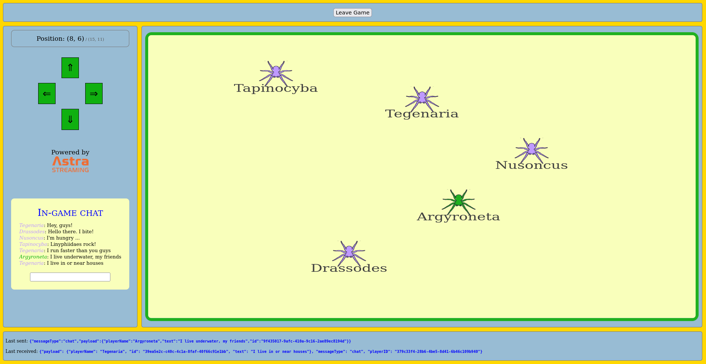
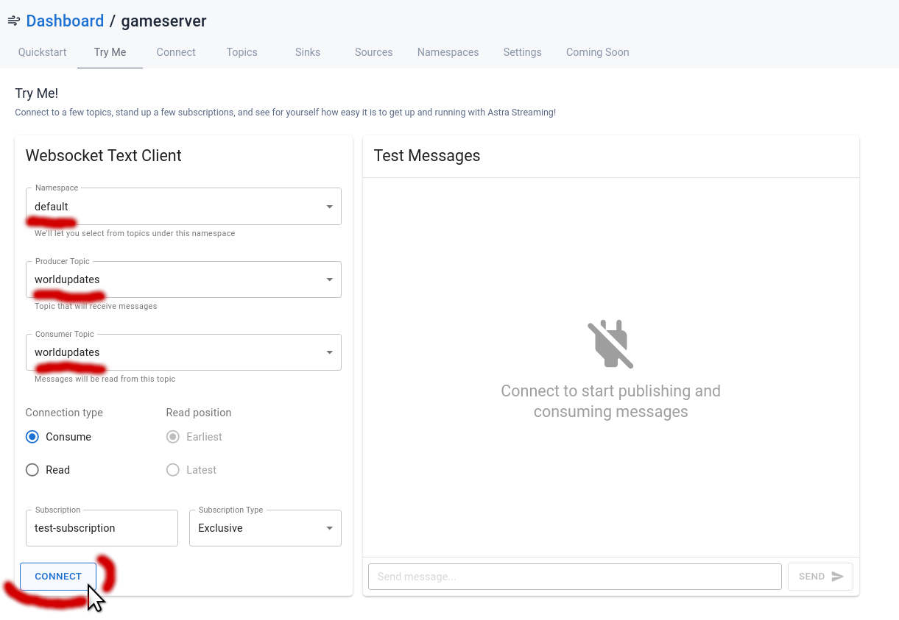

<!--- STARTEXCLUDE --->
# Drapetisca: a multiplayer online game with Astra Streaming and Websockets

Time: *50 minutes*. Difficulty: *Intermediate*. [Start Building!](#lets-start)

A simple multiplayer online game featuring
* Astra Streaming (built on top of Apache Pulsar)
* WebSockets
* React.js for the front-ent
* the Python FastAPI framework for the back-end

<!--- ENDEXCLUDE --->

## Objectives
* Understand the architecture of a streaming-based application
* Learn how Apache Pulsar works
* Learn about Websockets on client- and server-side
* Understand how a FastAPI server can bridge Pulsar topics and WebSockets
* Understand the structure of a Websocket React.js application
* **gain your very own online gaming platform to share with your friends!**

## Frequently asked questions

- *Can I run the workshop on my computer?*

> There is nothing preventing you from running the workshop on your own machine.
> If you do so, you will need
> * git installed on your local system
> * [node 15 and npm 7 or later](https://www.whitesourcesoftware.com/free-developer-tools/blog/update-node-js/)
> * Python v3.8+ installed on your local system
>
> In this readme, we try to provide instructions for local development as well - but keep in mind that
> the main focus is development on Gitpod, hence **We can't guarantee live support** about local development
> in order to keep on track with the schedule. However, we will do our best to give you the info you need to succeed.

- *What other prerequisites are there?*
> * You will need a github account
> * You will also need an Astra DB account: don't worry, we'll work through that in the following

- *Do I need to pay for anything for this workshop?*
> * **No.** All tools and services we provide here are FREE.

- *Will I get a certificate if I attend this workshop?*

> Attending the session is not enough. You need to complete the homeworks detailed below and you will get a nice badge.

- *Why "Drapetisca"?*

> _Drapetisca socialis_, known as "invisible spider", is a very small and hard-to-notice spider found throughout Europe.
> Since this is a multiplayer game that lets players have social interactions in the play area, why not choose a spider
> with "socialis" in its name?

## Materials for the Session

It doesn't matter if you join our workshop live or you prefer to do at your own pace, we have you covered. In this repository, you'll find everything you need for this workshop:

- [Slide deck](./slides/slides.pdf) TODO
- [Discord chat](https://bit.ly/cassandra-workshop)
- [Questions and Answers](https://community.datastax.com/)

## Homework

Don't forget to complete your upgrade and get your verified skill badge! Finish and submit your homework!

1. Complete the practice steps from this repository as described below.
2. TODO
3. TAKE A SCREENSHOT
5. Submit your homework [here](https://www.youtube.com/watch?v=dQw4w9WgXcQ) TODO

That's it, you are done! Expect an email in a few days!

# Let's start

## Table of contents

1. [Create your Astra Streaming instance](#1-login-or-register-to-astradb-and-create-database)
2. [Load the project into Gitpod](#2-)
3. [Set up/start the API](#3-)
4. [Set up/start the client](#4-)
5. [Play!](#5-)

## Astra setup

### 1. Create your Astra Streaming instance

_**`Astra Streaming`** is the simplest way to get a streaming infrastructure based on Apache Pulsar
with zero operations at all - just push the button and get your streaming.
No credit card required - with the free tier comes a generous monthly-renewed credit for you to use._

_**`Astra Streaming`** is tightly integrated with `Astra DB`, the database-as-a-service
used in most of our other workshops. **If you already have an Astra DB account, you can use that
one in the following!**_

For more information on Astra Streaming, look at [the docs](https://docs.datastax.com/en/astra-streaming/docs/).
For more information on Apache Pulsar, here is [the documentation](https://pulsar.apache.org/docs/en/concepts-overview/).

#### 1a. Register

Register and sign in to Astra at `https://astra.datastax.com` by clicking this button:

_you can use your `Github`, `Google` accounts or register with an `email`.
Choose a password with minimum 8 characters, containing upper and lowercase letters, at least one number and special character.
You may be asked to verify your email, so make sure you have access to it._

Show me the steps

    

#### 1b. Create streaming

Once registered and logged in, you will be able to create a streaming for use in this workshop.

> Heads up! Astra lets you also create Databases in the cloud (based on Apache Cassandra); in this workshop we will not need to,
> but keep that in mind. You can also effortlessly connect your streaming topics and an Astra DB instance to enrich your app!

Now it's time to create a new Astra Streaming topic, that will convey all messages for this app.

- Go to your Astra console, locate the "Create Streaming" button on the left and click on it.
- Set up a new Tenant (remember Pulsar has a multi-tenant architecture): _you have to find a globally unique name for it_,
so for instance if `gameserver` is already taken by someone, try `gameserver0`, `gameserver-abc` or something similar.
Pick the provider-region you like and finally hit "Create Tenant". **Remember the name of your tenant for the API setup step later**.
- You'll shortly see the dashboard for your newly-created Tenant. Go to the "Topics" tab to create a new one (we will stay in the "default" namespace).
- In the "Topics" tab, click "Add Topic" and name it `worldupdates` (persistent = yes, partitioned = no). Click "Save" to confirm topic creation.

> Note: technically you can name your namespace and topic anything you want - but then you have to make sure
> the environment settings for your API code are changed accordingly (see later).

Show me the steps

    

#### 1c. Check connection details

While you are at it, have a look at the information needed to connect to the topic
from the API code. While still in the tenant dashboard, find the "Connect" tab and click on it: you will see a listing of "Tenant Details".
You will later need the "Broker Service URL" and the "Token" values (the latter is hidden but can be copied nevertheless).

Show me the topic connection details

    

Congratulations! Your topic is being created, which takes less than one minute, and is now ready to receive and
dispatch the stream of messages that will make your game work!
_Time to prepare some code to be run..._

### 2. Load the project into Gitpod

Development and running will be done within a Gitpod instance (more on that in a second).

#### 2a. Open Gitpod

To load the whole project (API + client) in your personal Gitpod workspace, please
Ctrl-click (or right-click and open in new tab) on the following button:

(You may have to authenticate with Github or other providers along the process).
Then wait a couple of minutes for the installations to complete, at which point you
will see a message such as `CLIENT/API READY TO START` in the Gitpod console.

Show me what the Gitpod button does

- An IDE is started on a virtual machine in the cloud
- this repo is cloned there
- some initialization scripts are run (in particular, dependencies get installed)
- Gitpod offers a full IDE: you can work there, edit files, run commands in the console, use an internal browser, etc.

> In case you prefer to work _on your local computer_, no fear! You can simply keep
> a console open to run the React client (`cd client`) and another for the
> Python API (`cd api`). For the former
> you will have to `npm install` and for the latter (preferrably in a virtual environment
> to keep things tidy and clean) you will have to install the required dependencies
> e.g. with `pip install -r requirements.txt`. The rest of this readme will draw your
> attention to the occasional differences between the Gitpod and the local routes, but
> we'll generally assume that if you work locally you know what you are doing. Good luck!

#### 2b. Gitpod interface

Gitpod works as an in-browser IDE: 

This project is composed of two parts: client and API. For this reason, Gitpod
is configured to spawn _three_ different consoles: the "default" one for
general-purpose actions, an "api" console and a "client" console (these two
will start in the `api` and `client` subdirectories for you).
**You can switch between consoles by clicking on the items in the lower-right panels in your Gitpod**.

Show me a map of the Gitpod starting layout

    
    1 = file explorer, 2 = editor, 3 = panel for console(s), 4 = console switcher.

> Note: for your convenience, you find this very README open within the Gitpod
> text editor.

### 3. API setup

There are a couple of things to do before you can launch the API:

#### 3a. Environment variables

You need to pass the connection URL and secret to the API for it to be able
to speak to the Streaming topic. To do so, first **go to the API console**.

Then create a file `.env` by copying the `.env.sample` in the same directory,
with the commands

    cp ../.env.sample ../.env
    gp open ../.env

(the second will simply open the `.env` file in the editor)
and filling it with the values found earlier
on your Astra Streaming "Connect" tab (leave the other lines unchanged):

- `TENANT_NAME`: your very own tenant name as chosen earlier when creating the topic (step `1b`).
- `SERVICE_URL`: it looks similar to `pulsar+ssl://pulsar-aws-useast2.streaming.datastax.com:6651`
- `ASTRA_TOKEN`: a very long string (about 500 random-looking chars), see step `1c`. You can copy it without showing it.

> Note: treat your token as a personal secret: do not share it, do not commit it to the repo, store it in a safe place!

> Note: in case you gave a different namespace/name to your topic, update `.env` correspondingly.
> If, moreover, you work locally with a CentOS distribution you may have to check the `TRUST_CERTS` variable as well:
> check the "Connect" tab on your Astra Streaming console, looking for the Python/Consumer code sample there.

#### 3b. Start the API

Make sure you are in the API console. Export these environment variables for the API to pick them up when it starts:

    . ../.env

You can now *start the API* in this console:

    uvicorn api:app --reload

You should see the API start and log some messages in the console, in particular

    INFO:     Application startup complete.

Congratulations: they API is up and is ready to accept client requests.
Leave it running and turn your attention to the client.

> Note: this is how you start the API in a development environment. To deploy
> to production, you should set up a multi-process system service for `uvicorn`
> with the `--workers` option and put the whole thing behind an HTTP/2-capable
> reverse proxy. This is _not covered_ here.

### 4. Client setup

Make sure you **go to the client console** for the following.

#### 4a. Install dependencies

First ensure all required dependencies are installed:

    npm install

> Note: the command would take a few minutes; we secretly instructed Gitpod
> to preinstall them just to save you some time in this step - still, we want
> you to go through it. Obviously, if you are working on your local environment,
> this will be slower.

#### 4b. Start the client

The client is ready to go! Launch it in development mode with:

    npm start

Let's assume you are working within Gitpod, which wraps locally-exposed ports
and makes them accessible through ordinary HTTPS domain names.
As the client is available, Gitpod will automatically open it in its "simple browser",
using a domain such as `https://3000-tan-swallow-2yz174hp.ws-eu17.gitpod.io`.
This URL can be obtained also by typing, in the general-purpose Gitpod console,

    gp url 3000

(3000 being the port number locally used by npm to serve the client).
This will match the URL shown in the address bar of your simple browser.

Note that you can also take this URL and open the application in a new tab,
**which you are encouraged to do to use your full screen**.

> Note: we set up this workshop to make this URL accessible by anyone, to allow you
> to paste the link to your friends, thereby inviting them to your own game instance!

and makes them potentially accessible over the Internet.
Have a look at the address bar
in Gitpod's simple browser: it has been automatically converted from the
above `localhost` address to something such as
`https://3000-tan-swallow-2yz174hp.ws-eu17.gitpod.io`.

> If you are running everything locally on your computer, instead, you can
> open the client on `http://localhost:3000` and use the
> default API location of `ws://localhost:8000` to enter the game.

### 5. Play the game!

We finally have all pieces in place:

- an Astra Streaming topic;
- an API bridging it to ...
- ... a client ready to establish WebSocket connections.

It is time to play!

#### 5a. Enter the game

Change your name if you desire (a spider name is drawn at random for you).
You will also see that you are given a (read-only) unique player ID and that an API address
is configured for the client to establish WebSocket connections to.

> The API location points to the instance of the API running alongside the client:
> you should generally not have to change it (but please notice the protocol is
> either `ws` or `wss`, which stand for WebSocket and Secure WebSocket respectively).

To enter the game, click the "Enter Game" button.

Show me the "Enter Game" form

    

Well done: you are in the game! You should see your player appear in the arena!

Show me the player after entering the game

    

- To control your player, either use the on-screen arrow buttons or, after bringing the game field into focus, your keyboard's arrow keys;
- you can use the in-game chat box on the left;

Anything your player does is sent to the API through a WebSocket in the form of an "update message";
from there, it is published to the Astra Streaming topic. The API will then pick up the update
and broadcast to all players, whose client will process it, eventually leading to a refresh of the game status
on the front-end. All this happens in a near-real-time fashion at every action by every player.

> Note that the game shows the last sent message and the last received messages for you to better inspect
> the messaging pattern at play.

#### 5b. Try to cheat

Let's be honest: there's no multiplayer game without cheaters - at least, cheat attempts.
So try to walk beyond the boundaries of the play area, to see what happens.
Notice the "Position" caption on the left sidebar? If you keep an arrow key pressed
long enough, you will sure be able to bring that position to an illegal value such as `(-10, 0)`.
But as soon as you release the key, the position bounces back to a valid state.

Here's the trick: this "position", shown in the client, is nothing more than a variable
in the client's memory. Every update (including `(-10, 0)`) is sent to the API, which
is the sole actor in charge of validation: an illegal value will be corrected and sent back
to all clients. In particular, your own client will adjust knowledge of its own position
based on this feedback from the API - which is why you see the illegal value only briefly.

All of this must happen asynchronously, as is the nature of the communication between client
and API. There is a lesson here, which has been hard-earned by online game devs over the years:
_never leave validity checks in the hand of the client_.

> Remember the hordes of cheaters in ... er ... Diablo I ?

Unfortunately such an architecture is more complex to achieve, but you cannot do without it.
For instance, one has to introduce a "generation counter" to avoid accidentally triggering
infinite loops of spurious player-position updates.

**Relevant parts of the code**:

- API: `playerUpdate = validatePosition(updateMsg, HALF_SIZE_X, HALF_SIZE_Y)` in `api.py`
- Client: `setPlayerX(updateMsg.payload.x)` (and surrounding lines) in `App.js`.

#### 5c. "Hell is other people"

But wait ... this is a _multiplayer_ game, isn't it? So, go ahead and open a new
browser tab, then enter the game as someone else.

Hooray! As soon as you move around with this new player,
you will see the whole architecture at work:

- client sends updates on your player's position through the "player websocket"
- API validates this update and publishes it to the Astra Streaming topic
- API receives new messages by listening to this same Astra Streaming topic
- API broadcasts updates on any player to all connected clients through the "world websocket"
- at each such update, the client's game arena is adjusted (for all connected clients)

What is really cool is that **you can give this URL to your friends** and have them
enter your very own multiplayer game!

_Please do this and tell the world about how easy it is to build a multiplayer real-time
game with Astra Streaming!_

**NOTE** Please stop here for now.

## Fun with the Streaming UI

**NOTE**: this is not yet WORKING (I changed the message protocol and have to re-adapt my notes here)

The Astra Streaming interface makes it possible to eavesdrop on the topic and
observe the messages passing through it. This may prove very useful for
debugging.

In the Astra Streaming UI, head to the "Try Me" tab and make sure the namespace
and the (producer, consumer) topics are set to the values used earlier. Also
ensure the connection is of type "Consume" before clicking "Connect".

Now, if you move your player around in the client app, you will see the
corresponding messages flowing through the Streaming topic.

Of course now we want to "hack the system"! Indeed this same interface lets
you produce messages into the topic: let us insert a message such as

    {"playerName": "INTRUDER", "playerID": "1n7rud3r", "y": 3, "x": 3}

and check what happens on the game arena!

## Some more details on this game's messaging architecture

geometry, chat, updates + special update for leaving
